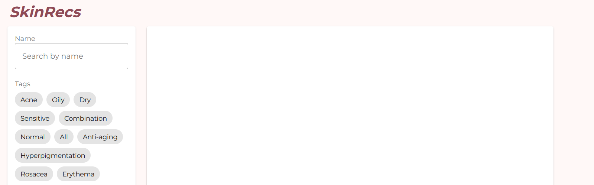

# SkinRecs

SkinRecs is a web app built with Express.js, MongoDB, Vue, and Vuetify. Made for my esthetician sister and her coworkers, it has authentication, product management, and user session handling.

## Figma link

[figma](https://www.figma.com/design/9L146pEzJebFsezt42CH9x/SkinRecs?node-id=0-1&amp;p=f&amp;t=kltjI4phqKclH8AK-0)

## Product Model

* "name": "string", // Required, unique
* "brand": "string", // Required
* "bar": "string", // Required
* "imageLink": "string", // Required
* "tags": ["string"],
* "user": "ObjectId" // References the User model

## User Model

* "email": "string", // Required, unique
* "encryptedPassword": "string", // Required
* "firstName": "string", // Required
* "lastName": "string" // Required

## REST Endpoints

### User Endpoints

| Name                       | Method | Path     |
| -------------------------- | ------ | -------- |
| Create new user            | POST   | /users   |
| Retrieve session_id/data   | GET    | /session |
| Verify user/log in         | POST   | /session |
| Remove Session data/logout | DELETE | /session |

### Product Endpoints

| Name                        | Method | Path                 |
| --------------------------- | ------ | -------------------- |
| Retrieve product collection | GET    | /products            |
| Create product member       | POST   | /products            |
| Update product member       | PUT    | /products/*\<id\>* |
| Delete product member       | DELETE | /products/*\<id\>* |
